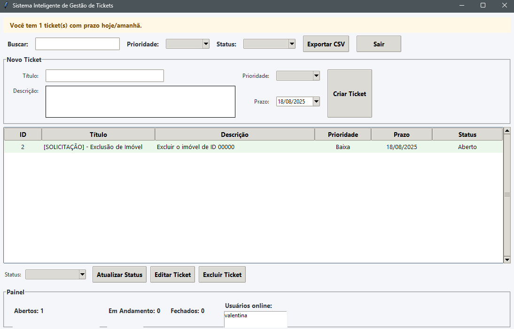

# Sistema Inteligente de Gestão de Tickets



Este projeto é um sistema de gestão de tickets desenvolvido em Python com interface gráfica em Tkinter. Foi criado como um projeto pessoal para treinamento e aplicação de conceitos voltados ao suporte técnico, facilitando o controle, acompanhamento e organização dos chamados de atendimento.

## Funcionalidades

- Cadastro e login de usuários com autenticação segura usando hashing de senhas (bcrypt).
- Criação, edição e exclusão de tickets com descrição, prioridade e status.
- Visualização dos tickets em uma lista com destaque colorido conforme a prioridade.
- Exportação dos dados para arquivo CSV para análise e controle externo.
- Interface simples e intuitiva para facilitar o uso diário.

## Motivação

Como analista de suporte técnico, a organização e a priorização dos chamados é fundamental para garantir um atendimento ágil e eficiente. Sistemas como Zendesk ou o CRM da Flip são ferramentas robustas, mas este projeto foi desenvolvido para entender melhor o processo e criar uma solução própria que ajude na gestão individual dos tickets, facilitando o acompanhamento dos chamados atribuídos a mim, com foco no bom fluxo e priorização das demandas.

## Tecnologias utilizadas

- Python 3.x
- Tkinter para interface gráfica
- SQLite para banco de dados local
- Bcrypt para hashing seguro de senhas
- CSV para exportação de dados

## Como executar

1. Clone este repositório:
   ```bash
   git clone https://github.com/seuusuario/sistema-inteligente.git

## Futuras melhorias

- Implementar notificações automáticas para tickets com prazo próximo.

- Integração com APIs externas para suporte via chat.

- Dashboard com gráficos mais detalhados de desempenho e tempo de resolução.

- Suporte multiusuário com níveis de permissão.
